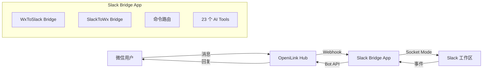
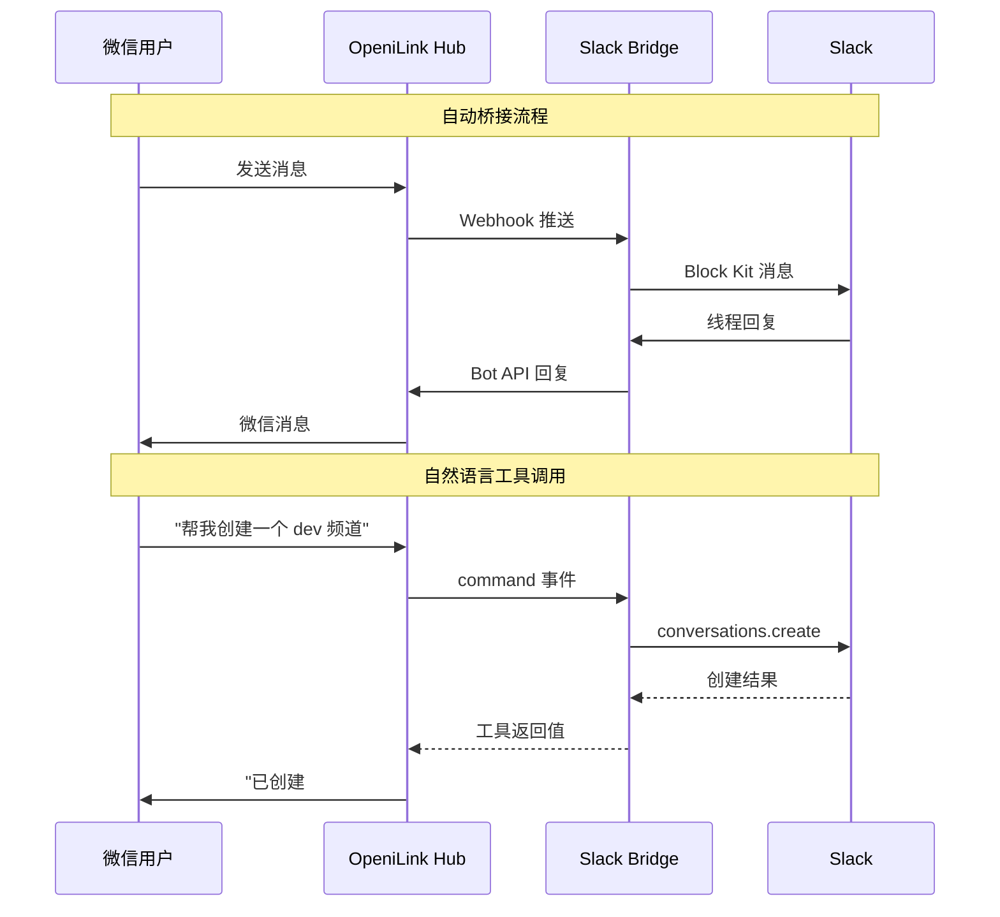

# @openilink/app-slack

[](./LICENSE)
[](https://nodejs.org/)
[](https://www.typescriptlang.org/)

**OpeniLink Hub App** -- 微信 ↔ Slack 双向消息桥接 + 23 个 AI Tools，覆盖消息、频道、用户、文件、提醒、书签六大模块。

> 本项目是 [OpeniLink Hub](https://github.com/openilink/openilink-hub) 的官方 App。Hub 是微信 Bot 的一站式管理平台，扫码绑定微信号即可使用。

---

## 功能亮点

- **微信 ↔ Slack 双向桥接**：微信消息自动转发到 Slack 频道（Block Kit 格式），Slack 回复自动发送回微信
- **自然语言操作 Slack**：在微信中说"帮我创建一个 dev 频道"，Hub AI 自动调用 Slack API 完成操作
- **23 个 AI Tools，覆盖 6 大模块**：消息、频道、用户、文件、提醒、书签
- **Socket Mode 连接**：Slack 端使用 Socket Mode，无需为 Slack 配置公网入口
- **安全验证**：Webhook 签名验证 + OAuth PKCE 安装流程
- **SQLite 持久化**：消息映射和安装记录存储在本地数据库，消息内容不落盘

---

## 使用方式

安装到 Bot 后，支持三种方式调用：

### 自然语言（推荐）

直接用微信跟 Bot 对话，Hub AI 会自动识别意图并调用对应功能：

- "在 Slack 频道里发一条消息说项目上线了"
- "查看 Slack 频道的最近消息"
- "创建一个叫 project-alpha 的私有频道"
- "提醒我明天下午 3 点开会"

### 命令调用

也可以使用 `/命令名 参数` 的格式直接调用：

- `/send_slack_message --channel C123 --text Hello`

### AI 自动调用

Hub AI 在多轮对话中会自动判断是否需要调用本 App 的功能，无需手动触发。

---

## 支持的 23 个 Tools

### 消息操作（Messaging）

| 工具名 | 说明 |
|--------|------|
| `send_message` | 发送消息到频道 |
| `reply_message` | 回复消息（线程回复） |
| `update_message` | 更新已发送的消息 |
| `delete_message` | 删除消息 |
| `get_channel_history` | 获取频道消息历史 |
| `get_thread_replies` | 获取线程回复列表 |
| `add_reaction` | 添加表情反应 |
| `remove_reaction` | 移除表情反应 |
| `pin_message` | 置顶消息 |
| `unpin_message` | 取消置顶 |

### 频道操作（Channels）

| 工具名 | 说明 |
|--------|------|
| `list_channels` | 列出所有频道 |
| `create_channel` | 创建新频道 |
| `invite_to_channel` | 邀请用户加入频道 |
| `archive_channel` | 归档频道 |
| `set_channel_topic` | 设置频道话题 |

### 文件操作（Files）

| 工具名 | 说明 |
|--------|------|
| `upload_file` | 上传文件到频道 |
| `list_files` | 列出文件列表 |

### 用户操作（Users）

| 工具名 | 说明 |
|--------|------|
| `get_user_info` | 获取用户详细信息 |
| `list_users` | 列出工作区用户 |

### 提醒操作（Reminders）

| 工具名 | 说明 |
|--------|------|
| `add_reminder` | 创建提醒 |
| `list_reminders` | 列出提醒列表 |

### 书签操作（Bookmarks）

| 工具名 | 说明 |
|--------|------|
| `add_bookmark` | 添加频道书签 |
| `list_bookmarks` | 列出频道书签 |

---

## 快速开始

### 应用市场一键安装（推荐）

在 [OpeniLink Hub](https://github.com/openilink/openilink-hub) 的应用市场中搜索「Slack」，一键安装即可使用，无需自行部署。

<details>
<summary><strong>自部署（Docker）</strong></summary>

```bash
docker compose up -d
```

或手动运行：

```bash
docker build -t openilink-app-slack .
docker run -d \
  -p 8082:8082 \
  -e HUB_URL="https://your-hub.example.com" \
  -e BASE_URL="https://your-app.example.com" \
  -e SLACK_BOT_TOKEN="xoxb-xxx" \
  -e SLACK_APP_TOKEN="xapp-xxx" \
  -e SLACK_CHANNEL_ID="C0123456789" \
  -v app-data:/data \
  openilink-app-slack
```

</details>

<details>
<summary><strong>环境变量</strong></summary>

| 变量名 | 必填 | 默认值 | 说明 |
|--------|------|--------|------|
| `HUB_URL` | 是 | - | OpeniLink Hub 服务地址 |
| `BASE_URL` | 是 | - | 当前 App 的公网访问地址 |
| `SLACK_BOT_TOKEN` | 是 | - | Slack Bot User OAuth Token（`xoxb-` 开头） |
| `SLACK_APP_TOKEN` | 是 | - | Slack App-Level Token（`xapp-` 开头，Socket Mode 用） |
| `SLACK_CHANNEL_ID` | 是 | - | 默认转发微信消息到的 Slack 频道 ID |
| `PORT` | 否 | `8082` | HTTP 服务端口 |
| `DB_PATH` | 否 | `data/slack.db` | SQLite 数据库文件路径 |

</details>

<details>
<summary><strong>从源码构建</strong></summary>

```bash
git clone https://github.com/openilink/openilink-app-slack.git && cd openilink-app-slack
npm install
cp .env.example .env
# 编辑 .env 填入你的配置

# 开发模式（热重载）
npm run dev

# 生产模式
npm run build
npm start
```

</details>

---

<details>
<summary><strong>Slack 应用配置指南</strong></summary>

### 1. 创建 Slack App

1. 前往 [Slack API](https://api.slack.com/apps) 创建新的 App
2. 选择 **From scratch**，填写 App Name 和 Workspace
3. 进入 **OAuth & Permissions**，添加以下 Bot Token Scopes：
   - `channels:history` - 读取频道消息
   - `channels:manage` - 管理频道
   - `channels:read` - 读取频道列表
   - `chat:write` - 发送消息
   - `files:read` - 读取文件
   - `files:write` - 上传文件
   - `groups:history` - 读取私有频道消息
   - `groups:read` - 读取私有频道列表
   - `groups:write` - 管理私有频道
   - `im:history` - 读取私信
   - `pins:read` - 读取置顶
   - `pins:write` - 管理置顶
   - `reactions:read` - 读取表情反应
   - `reactions:write` - 添加表情反应
   - `reminders:read` - 读取提醒
   - `reminders:write` - 管理提醒
   - `bookmarks:read` - 读取书签
   - `bookmarks:write` - 管理书签
   - `users:read` - 读取用户信息
   - `users:read.email` - 读取用户邮箱

### 2. 启用 Socket Mode

1. 进入 **Socket Mode** 页面，启用 Socket Mode
2. 生成一个 App-Level Token（Scope 选择 `connections:write`），记录 `xapp-` 开头的 Token

### 3. 安装 App 到 Workspace

1. 进入 **Install App** 页面，点击 **Install to Workspace**
2. 授权安装
3. 记录 **Bot User OAuth Token**（`xoxb-` 开头）

### 4. 订阅事件

1. 进入 **Event Subscriptions**，启用 Events
2. 订阅以下 Bot Events：
   - `message.channels` - 公共频道消息
   - `message.groups` - 私有频道消息

</details>

---

<details>
<summary><strong>架构与消息流转</strong></summary>

### 架构图



### 消息流转



### 自动桥接

微信用户发送的消息会通过 Hub Webhook 推送到本 App，然后以 Block Kit 格式转发到指定 Slack 频道。Slack 用户在对应消息线程中回复时，App 会通过 Hub Bot API 将回复发送回微信用户。

### 自然语言工具调用

当 Hub 的 AI 识别到用户意图匹配某个 Tool 时，会发送 `command` 事件到 App。App 的 Router 根据命令名路由到对应的 Tool Handler，执行 Slack API 操作后返回结果。Hub AI 将结果格式化后回复给微信用户。

</details>

---

<details>
<summary><strong>开发指南</strong></summary>

### 常用命令

```bash
# 安装依赖
npm install

# 开发模式
npm run dev

# 编译
npm run build

# 生产运行
npm start

# 运行测试
npm test

# 监听模式测试
npm run test:watch

# 类型检查
npx tsc --noEmit
```

### 项目结构

```
src/
├── index.ts              # 主入口
├── config.ts             # 配置加载
├── store.ts              # SQLite 存储层
├── router.ts             # 命令路由器
├── hub/
│   ├── types.ts          # Hub 类型定义
│   ├── client.ts         # Hub Bot API 客户端
│   ├── manifest.ts       # App Manifest 生成
│   ├── oauth.ts          # OAuth PKCE 安装流程
│   └── webhook.ts        # Webhook 事件处理
├── slack/
│   ├── client.ts         # Slack 客户端封装
│   └── event.ts          # Slack Bolt App & 事件监听
├── bridge/
│   ├── wx-to-slack.ts    # 微信 → Slack 消息桥接
│   └── slack-to-wx.ts    # Slack → 微信 消息桥接
├── tools/
│   ├── index.ts          # Tool 注册入口
│   ├── messaging.ts      # 消息操作 Tools
│   ├── channels.ts       # 频道操作 Tools
│   ├── files.ts          # 文件操作 Tools
│   ├── users.ts          # 用户操作 Tools
│   ├── reminders.ts      # 提醒操作 Tools
│   └── bookmarks.ts      # 书签操作 Tools
└── utils/
    └── crypto.ts         # 签名验证 & PKCE 生成
```

</details>

---

## 安全与隐私

### 数据处理说明

- **消息内容不落盘**：本 App 在转发消息时，消息内容仅在内存中中转，**不会存储到数据库或磁盘**
- **仅保存消息 ID 映射**：数据库中只保存消息 ID 的对应关系（用于回复路由），不保存消息正文
- **用户数据严格隔离**：所有数据库查询均按 `installation_id` + `user_id` 双重过滤，不同用户之间完全隔离，无法互相访问

### 应用市场安装（托管模式）

通过 OpeniLink Hub 应用市场一键安装时，消息将通过我们的服务器中转。我们承诺：

- 不会记录、存储或分析用户的消息内容
- 不会将用户数据用于任何第三方用途
- 所有 App 代码完全开源，接受社区审查
- 我们会对每个上架的 App 进行严格的安全审查

### 自部署（推荐注重隐私的用户）

如果您对数据隐私有更高要求，建议自行部署本 App。自部署后所有数据仅在您自己的服务器上流转，不经过任何第三方。

## License

[MIT](./LICENSE)
